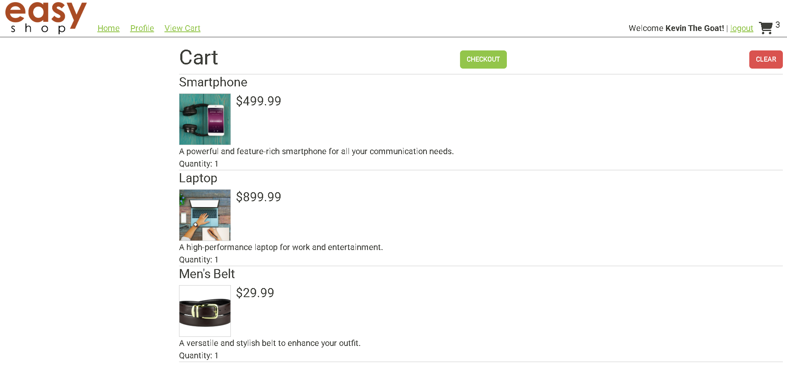

# Easy Shop: E-Commerce API

## Table of Contents

- [Description](#description)
- [Technologies Used](#technologies-used)
- [Features](#features)
- [Images](#images)
- [Usage](#usage)
- [Testing](#testing)
- [Key Takeaways](#key-takeaways-from-project)
- [License](#license)
- [Contributing](#contributing)
- [Questions](#questions)

## Description

- The Easy Shop E-Commerce API is the server side for Easy Shop, an application where users can create an account to
  shop for products, add products to their cart, and order items. The Easy Shop API is a RESTful API that implements the
  Spring Boot framework and a SQL database to manage products, users, user profiles, user shopping cart, and user orders
  in a SQL database.
- This project is version 2 of Easy Shop. Version 2 fixed bugs where search product returned incorrect results and
  update product created a new product with slightly different values instead of updating the existing product. Version
  2 also comes with some new features!

## Technologies Used

- Backend (server side)
    - Java 17
    - Spring Boot
    - Spring Web
    - JWT-based authentification
    - MySQL
    - Maven
    - Postman to test endpoints
- Frontend (client side)
    - HTML
    - CSS
    - JavaScript
    - Axios (for getting and returning data to the backend)

---

## Features

1) **Shopping Cart!** 
   - A user can now add items into their shopping cart. These items will stay in the cart until the
      user clears the cart or checks out. That means now you can add items into your cart, log out, and the next time you
      log in, those items will still be there waiting for you to order!
2) **User profiles!** 
   - A user can now create and update their profile!
3) **Order items / checkout!!!**
   - That's right, you are now able to order the items that you put into your cart! When you
      check out the cart will automatically empty and your order will be placed and logged into our database. 

---
**COMING SOON**: 
   - **View orders!** Soon you will be able to view the items that you have ordered in the past!

## Images

___

___
___

___
___

___
___

___
___

## Usage

#### Requirements

- JDK 17+
- MySQL Server
- IntelliJ IDEA

#### To Run the Application:

___

1) Clone the repository code to your local workspace.
2) Copy the `create_database.sql` file from the `/database` directory. Open MySQL Workbench and paste and run the
   queries.
3) Update the `application.properties` file in `/src/main/resources/` directory.
4) Run the `EasyshopApplication` class in `/src/main/java/org/yearup/` directory.

## Testing

---

- You can test the endpoints in Postman.
- This application also contains unit tests in `/src/test/java/org/yearup/data/mysql` directory.
- To run these unit tests, first you must navigate to `/src/test/resources/application.properties` and update the file
  with your SQL information.
- After updating the `application.properties` file, you are free to unit test your heart out!

---

## Key Takeaways From Project
[What I learned / key takeaways from this project](capstone-starter/key-takeaways/Easyshop_API-Key_Takeaways.md)

---

## License

There is no license for this application.

## Contributing

### Please contribute to this project:

- [Submit Bugs and Request Features you'd like to see Implemented](https://github.com/krosengr4/capstone-3/issues)

## Questions

- [Link to my GitHub Profile](https://github.com/krosengr4)

- For any additional questions, email me at rosenkev4@gmail.com
